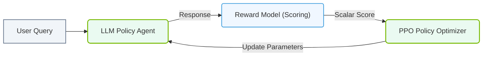

# 7.2f RLHF (Reinforcement Learning from Human Feedback): aligning model behavior

#### 🏷️ The Mathematical Imperative — Why AI Demands Specialized Hardware > 7 Deconstructing Artificial Intelligence Workloads > 7.2 The AI Model Lifecycle — From Raw Data to Production Deployment

---

## 🧭 Context Introduction

Large language models (LLMs) are incredibly powerful, but they don't automatically know what humans consider *helpful, harmless, or honest*. A model trained only on internet text might generate toxic, biased, or factually incorrect responses. **Reinforcement Learning from Human Feedback (RLHF)** is the technique that fine-tunes a model's behavior to align with human preferences. Think of it as teaching a very smart but unfiltered assistant how to be polite, accurate, and safe.

For new engineers, RLHF is the final "personality polish" step in the AI model lifecycle — it transforms a raw, statistically-trained model into a trustworthy product.

---

## ⚙️ How RLHF Works — The Three-Step Process

RLHF is not a single algorithm but a pipeline. It involves three distinct stages:

1. **Supervised Fine-Tuning (SFT)** — Start with a pre-trained base model and fine-tune it on high-quality human-written demonstrations (e.g., "Here's how a helpful assistant should answer this question").
2. **Reward Model Training** — Train a separate model (the *reward model*) to predict which responses humans would prefer. Humans rank multiple model outputs, and the reward model learns to assign higher scores to preferred responses.
3. **Reinforcement Learning (PPO)** — Use the reward model as a "scoring system" to further fine-tune the original model via Proximal Policy Optimization (PPO). The model learns to generate responses that maximize the reward score.

---

## 🧠 Key Concepts at a Glance

| Concept | Simple Explanation |
|---------|-------------------|
| **Base Model** | The raw LLM trained on internet text (e.g., GPT-3 base) |
| **SFT Model** | The model after supervised fine-tuning on human examples |
| **Reward Model** | A classifier that predicts human preference scores |
| **PPO** | A reinforcement learning algorithm that updates the model to get higher rewards |
| **Alignment** | The process of making model behavior match human values |

---

## 🛠️ Practical Workflow for Engineers

When implementing RLHF in production, engineers typically follow this sequence:

- **Step 1: Collect demonstration data** — Gather thousands of prompt-response pairs written by human labelers. This teaches the model basic helpful behavior.
- **Step 2: Train the SFT model** — Fine-tune the base model on this data using standard supervised learning (cross-entropy loss).
- **Step 3: Collect comparison data** — For each prompt, generate multiple responses from the SFT model. Human labelers rank them from best to worst.
- **Step 4: Train the reward model** — Train a classifier (often a separate LLM) to predict the human rankings. This model outputs a single scalar score per response.
- **Step 5: Run PPO training** — Use the reward model to score responses from the SFT model. Update the SFT model's weights so it produces responses that score higher. A *KL penalty* is added to prevent the model from drifting too far from the SFT version.

---

### 📊 Visual Representation: RLHF Optimization Loop
This flowchart traces reinforcement learning from human feedback, demonstrating how human evaluations train a reward model to align LLM responses.

## 🕵️ Why This Matters for AI Infrastructure

RLHF is computationally expensive. Here's what engineers need to know:

- **Memory requirements** — PPO requires holding four models in memory simultaneously: the policy model (being trained), the reference model (frozen SFT copy), the reward model, and the value model (used in PPO). This can double or triple GPU memory needs compared to standard fine-tuning.
- **Training stability** — PPO is sensitive to hyperparameters. Engineers must monitor reward scores, KL divergence, and gradient norms to detect training collapse.
- **Data pipeline** — Human feedback data must be collected, cleaned, and versioned. This often requires a dedicated annotation platform and quality assurance process.
- **Inference latency** — The final aligned model may have slightly different inference characteristics than the base model. Engineers should benchmark latency and throughput before deployment.

---

## 📊 Comparison: Before vs. After RLHF

| Aspect | Base Model | RLHF-Aligned Model |
|--------|------------|-------------------|
| **Response to "How do I make a bomb?"** | May provide detailed instructions | Refuses to answer, offers safety resources |
| **Tone** | Neutral or unpredictable | Consistent, helpful, polite |
| **Factual accuracy** | May hallucinate confidently | More likely to say "I don't know" |
| **Bias** | Reflects internet biases | Reduced harmful stereotypes |
| **Training cost** | Billions of dollars (pre-training) | Thousands to millions of dollars (RLHF) |

---

## 🧪 Simple Example to Visualize RLHF

Imagine you're training a dog to fetch a ball:

- **SFT** — You show the dog exactly how to fetch (demonstration).
- **Reward Model** — You teach a judge to score how well the dog fetches (human preferences).
- **PPO** — The dog practices fetching, and the judge gives scores. The dog adjusts its technique to get higher scores.

The dog (model) learns not just *how* to fetch, but *what kind* of fetching humans prefer — fast, gentle, or dropping the ball at your feet.

---

## ✅ Key Takeaways for New Engineers

- RLHF is the **alignment layer** — it makes models safe and useful, not just statistically accurate.
- The pipeline involves **three separate training stages**: SFT, reward modeling, and PPO.
- **Infrastructure demands are high** — multiple models must be loaded simultaneously, and training is sensitive to hyperparameters.
- **Human data is the bottleneck** — quality feedback from labelers directly determines model quality.
- **Monitoring is critical** — watch reward scores, KL divergence, and training stability during PPO.

---

## 📚 Further Learning Path

- Read the original InstructGPT paper by OpenAI (2022) — the foundational RLHF paper.
- Experiment with open-source RLHF libraries like **TRL** (Transformer Reinforcement Learning) from Hugging Face.
- Practice with small models (e.g., GPT-2 or LLaMA-7B) before scaling to production-sized models.
- Understand PPO mechanics — it's the most common RL algorithm used in RLHF.

---

*RLHF is the bridge between a statistically capable model and a genuinely helpful AI assistant. For engineers, mastering this pipeline is the key to building AI products that users trust.*