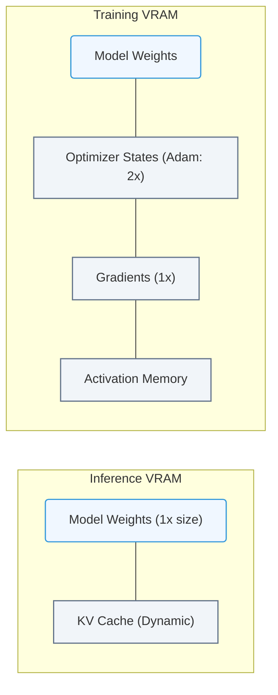

# 7.3b Parameters: what billions of weights actually are and why they need VRAM

#### 🏷️ The Mathematical Imperative — Why AI Demands Specialized Hardware > 7 Deconstructing Artificial Intelligence Workloads > 7.3 Large Language Models (LLMs) — The Architecture Driving Modern AI Infrastructure

---

## 🧠 Context Introduction

When you hear about AI models like GPT-4 or Llama 3 having "70 billion parameters," it sounds impressive but abstract. For engineers new to AI infrastructure, understanding what these parameters *actually are* — and why they consume so much VRAM (Video Random Access Memory) — is essential. This topic breaks down the concept of parameters (weights) into simple, tangible ideas, and explains the direct relationship between model size and hardware requirements.

---

## ⚙️ What Are Parameters (Weights)?

Parameters are the **learned values** inside a neural network. Think of them as the "knobs and dials" that the model adjusts during training to make accurate predictions.

- **Weights** determine how strongly one neuron (node) influences another.
- **Biases** are additional values that help the model fit data more flexibly.
- Together, weights and biases are called **parameters**.

### 🧩 Simple Analogy: A Recipe Book

Imagine you have a recipe book with 70 billion instructions. Each instruction tells the model:  
*"If you see this word pattern, multiply it by this number, then add this other number."*

- Each **weight** is like a single ingredient measurement (e.g., 2 cups of flour).
- Each **bias** is like an adjustment (e.g., add a pinch of salt).
- The model uses all these instructions together to predict the next word in a sentence.

---

## 📊 Why Are There Billions of Parameters?

Modern LLMs are **deep neural networks** with many layers. Each layer contains thousands of neurons, and every connection between neurons has its own weight.

### 🧮 How the Numbers Add Up

| Component | Example Count | Why It Matters |
|-----------|---------------|----------------|
| Layers | 80–100+ | More layers = deeper understanding |
| Neurons per layer | 4,000–16,000 | More neurons = more pattern recognition |
| Connections between layers | Layer A × Layer B | Each connection = one weight |
| Total parameters | 7B, 70B, 175B+ | Sum of all weights + biases |

For a 70B parameter model:
- **70,000,000,000** individual floating-point numbers.
- Each number is typically stored as a **16-bit** or **32-bit** value.

---

## 🛠️ Why Do Parameters Need VRAM?

VRAM is the memory on a GPU. It holds the model's parameters so the GPU can access them quickly during inference (running the model) or training.

### 🧠 The Core Reason: Speed

- GPUs are designed for **parallel processing** — they can perform millions of calculations simultaneously.
- To do this, all the parameters must be **loaded into VRAM** before any calculation starts.
- If parameters are stored in system RAM (CPU memory), the GPU would have to wait for data to transfer — causing massive slowdowns.

### 📐 The Math of VRAM Usage

Here's a simple formula to estimate VRAM needed for a model:

**VRAM (in GB) = (Number of Parameters × Bytes per Parameter) × Overhead Factor**

- **Bytes per parameter** depends on precision:
  - **FP32** (32-bit float) = 4 bytes per parameter
  - **FP16** (16-bit float) = 2 bytes per parameter
  - **INT8** (8-bit integer) = 1 byte per parameter

### 📊 Example: 70B Parameter Model

| Precision | Bytes per Parameter | Raw VRAM Needed | With Overhead (~20%) |
|-----------|---------------------|-----------------|----------------------|
| FP32 | 4 bytes | 280 GB | ~336 GB |
| FP16 | 2 bytes | 140 GB | ~168 GB |
| INT8 | 1 byte | 70 GB | ~84 GB |

**Key Insight:**  
Using lower precision (FP16 or INT8) dramatically reduces VRAM requirements. This is why engineers use techniques like **quantization** to run large models on smaller GPUs.

---

### 📊 Visual Representation: Model Parameter Memory Footprint
This diagram outlines how model parameters translate to physical GPU memory (VRAM) during training vs. inference (including optimizer states).

## 🕵️ Real-World Implications for Engineers

### 🖥️ GPU Selection

- A single **NVIDIA H100 (80 GB VRAM)** can run a 70B model only if it's quantized to INT8 or FP16 with optimizations.
- For **FP32**, you'd need multiple GPUs (e.g., 4 × H100) working together via **model parallelism**.

### 🧩 Memory Bottlenecks

- **Inference:** You need enough VRAM to hold the model + some workspace for calculations.
- **Training:** You need VRAM for the model, optimizer states (e.g., Adam), gradients, and activations — often 2–4× the model size.

### 🛠️ Practical Takeaway

When an engineer says *"This model requires 80 GB of VRAM,"* they mean:
- The model has ~40 billion parameters at FP16 precision.
- Or ~20 billion parameters at FP32 precision.
- You need a GPU with at least that much memory, or you must split the model across multiple GPUs.

---

## 📋 Summary Table: Parameters ↔ VRAM Relationship

| Model Size (Parameters) | FP32 VRAM | FP16 VRAM | INT8 VRAM | Typical GPU Needed |
|-------------------------|-----------|-----------|-----------|---------------------|
| 7B (Llama 2 7B) | 28 GB | 14 GB | 7 GB | 1 × RTX 4090 (24 GB) |
| 13B (Llama 2 13B) | 52 GB | 26 GB | 13 GB | 1 × A100 (40 GB) or 2 × RTX 4090 |
| 70B (Llama 2 70B) | 280 GB | 140 GB | 70 GB | 2–4 × H100 (80 GB) |
| 175B (GPT-3) | 700 GB | 350 GB | 175 GB | 8+ × H100 |

---

## ✅ Key Takeaways for New Engineers

1. **Parameters = weights + biases** — the learned "knowledge" of the model.
2. **Billions of parameters** mean billions of floating-point numbers that must be stored in VRAM.
3. **VRAM is essential** because GPUs need instant access to all parameters for fast parallel computation.
4. **Precision matters** — using FP16 or INT8 can cut VRAM requirements by 50–75%.
5. **Model size directly dictates hardware needs** — a 70B model cannot run on a single consumer GPU without quantization or splitting.

---

## 🔍 Next Steps

- Learn about **quantization techniques** (e.g., NVIDIA TensorRT-LLM, AWQ, GPTQ).
- Understand **model parallelism** (tensor parallelism vs. pipeline parallelism).
- Experiment with **Hugging Face Transformers** to see VRAM usage in real time using `torch.cuda.memory_summary()`.

> 💡 **Pro Tip:** Always check the model card on Hugging Face or NVIDIA NGC for recommended VRAM and precision settings before deploying.