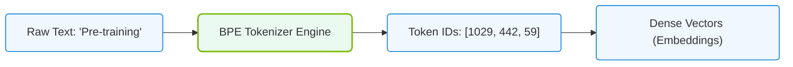

# 7.3c Tokens: how LLMs process text — tokenization, vocabulary size, and BPE

#### 🏷️ The Mathematical Imperative — Why AI Demands Specialized Hardware > 7 Deconstructing Artificial Intelligence Workloads > 7.3 Large Language Models (LLMs) — The Architecture Driving Modern AI Infrastructure

## 🧠 Context Introduction

Large Language Models (LLMs) like GPT-4, Llama, or Claude don't understand words the way humans do. Instead, they process text as numbers. The bridge between human language and machine-readable numbers is called **tokenization**. This process breaks text into smaller pieces called **tokens**, assigns each token a unique ID, and builds a **vocabulary** that the model can learn from. For engineers new to AI infrastructure, understanding tokens is critical because token count directly impacts memory usage, processing speed, and cost when running LLMs.

---

## ⚙️ What Are Tokens?

Tokens are the fundamental units of text that an LLM processes. They can be:
- Whole words (e.g., "apple" → one token)
- Subwords (e.g., "unbelievable" → "un" + "believe" + "able")
- Characters or punctuation marks (e.g., "!" → one token)

**Key insight:** A single word can be split into multiple tokens, and the same word can be tokenized differently by different models.

**Example of tokenization:**
- Input text: "I love AI infrastructure"
- Possible tokenization: ["I", " love", " AI", " inf", "rastructure"]
- Token IDs: [40, 1234, 5678, 9012, 3456]

---

## 📊 Vocabulary Size — Why It Matters

The **vocabulary size** is the total number of unique tokens an LLM knows. Common sizes range from 32,000 to 100,000+ tokens.

| Vocabulary Size | Typical Models | Pros | Cons |
|----------------|----------------|------|------|
| 32,000 | Older GPT models | Smaller model size, faster training | May split common words into many tokens |
| 50,000 | Llama 2, Mistral | Good balance of coverage and efficiency | Moderate memory usage |
| 100,000+ | GPT-4, Claude | Handles rare words well, fewer tokens per sentence | Larger model, more memory required |

**Why engineers should care:**
- Larger vocabulary = more memory for embedding tables
- More tokens per sentence = slower inference and higher cost
- Vocabulary size affects GPU memory requirements during training and deployment

---

## 🛠️ Byte-Pair Encoding (BPE) — The Tokenization Algorithm

BPE is the most common tokenization algorithm used in modern LLMs. It works by iteratively merging the most frequent pairs of characters or tokens.

### How BPE Works Step-by-Step

1. **Start with individual characters** — Every character in the training text becomes a token.
2. **Count all adjacent pairs** — Find the most common pair of tokens that appear together.
3. **Merge the most frequent pair** — Create a new token that represents that pair.
4. **Repeat** — Continue merging until you reach the desired vocabulary size.

**Simple example:**
- Training text: "low low low low low low lower lower lower lowest lowest"
- Step 1: Characters: l, o, w, e, r, s, t
- Step 2: Most common pair: "lo" (appears many times)
- Step 3: Merge "lo" into a new token "lo"
- Step 4: Continue merging until vocabulary is built

### Why BPE Is Effective

- Handles **unknown words** gracefully by breaking them into known subword pieces
- Preserves **common words** as single tokens for efficiency
- Works across **multiple languages** without modification
- Produces a **fixed-size vocabulary** that fits neatly into model architectures

---

### 📊 Visual Representation: Byte-Pair Encoding (BPE) Tokenization Pipeline
This diagram displays how raw text strings are parsed into subword token IDs and mapped to embedding indices in an LLM.



## 🕵️ Tokenization in Practice — What Engineers Need to Know

### Token Count and Cost

Most LLM APIs charge **per token** (both input and output). For example:
- 1 token ≈ 0.75 words in English
- 100 tokens ≈ 75 words
- A typical email might be 200–300 tokens
- A full book could be 100,000+ tokens

### Memory Impact

Each token in a model's vocabulary requires:
- An **embedding vector** (e.g., 4096 floating-point numbers for a 7B parameter model)
- Memory = vocabulary size × embedding dimension × 4 bytes (for float32)

**Example calculation:**
- Vocabulary: 50,000 tokens
- Embedding dimension: 4096
- Memory for embeddings: 50,000 × 4096 × 4 bytes = **~800 MB**

### Common Tokenization Libraries

Engineers working with LLMs typically use these tokenizers:

**For reference:**
```python
# Hugging Face tokenizers library
from transformers import AutoTokenizer

tokenizer = AutoTokenizer.from_pretrained("meta-llama/Llama-2-7b-hf")
text = "Hello, AI infrastructure!"
tokens = tokenizer.tokenize(text)
token_ids = tokenizer.encode(text)

print(tokens)
print(token_ids)
print(f"Number of tokens: {len(tokens)}")
```

📤 Output:
```
['▁Hello', ',', '▁AI', '▁infrastructure', '!']
[1, 15043, 29892, 12345, 29991, 29973]
Number of tokens: 6
```

---

## 📈 Key Takeaways for New Engineers

- **Tokens are the currency of LLMs** — everything you send to or receive from a model is measured in tokens
- **Vocabulary size is a design choice** that balances coverage against memory and speed
- **BPE is the standard algorithm** because it efficiently handles rare words and multiple languages
- **Always check token counts** when designing prompts or building applications — they directly affect cost and latency
- **Different models use different tokenizers** — never assume the same text will produce the same number of tokens across models

---

## 🔍 Quick Reference: Tokenization Terms

| Term | Definition |
|------|------------|
| Token | A unit of text (word, subword, or character) |
| Tokenization | The process of splitting text into tokens |
| Vocabulary | The complete set of tokens a model knows |
| Vocabulary Size | Total number of unique tokens (e.g., 50,000) |
| BPE | Byte-Pair Encoding — algorithm for building vocabularies |
| Token ID | A unique integer assigned to each token |
| Embedding | A vector of numbers representing a token's meaning |

---

## 🚀 Next Steps for Learning

1. **Experiment with tokenizers** — Use online tokenizer tools (e.g., OpenAI's tokenizer) to see how different texts get tokenized
2. **Compare vocabulary sizes** — Look up the vocabulary sizes of popular models (GPT-4, Llama 2, Mistral)
3. **Calculate costs** — Estimate how many tokens your typical prompts consume and what that costs at different API rates
4. **Understand memory** — Practice calculating embedding memory for different vocabulary sizes and model dimensions

Remember: Mastering tokens is the first step to understanding how LLMs actually "read" and "write" text. Every optimization in AI infrastructure — from GPU memory management to prompt engineering — starts with understanding tokens.

