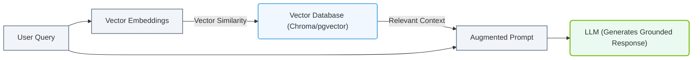

# 7.3e Embedding models, rerankers, and the retrieval-augmented generation (RAG) pipeline

#### 🏷️ The Mathematical Imperative — Why AI Demands Specialized Hardware > 7 Deconstructing Artificial Intelligence Workloads > 7.3 Large Language Models (LLMs) — The Architecture Driving Modern AI Infrastructure

## 🧭 Context Introduction

Imagine you're building a smart assistant that needs to answer questions about your company's internal documents — but the LLM was only trained on public internet data up to 2023. How does it know about your latest product launch? This is where **Retrieval-Augmented Generation (RAG)** comes in. Instead of retraining the entire model, RAG lets the LLM "look up" relevant information from your own database before generating an answer. Think of it like giving a student (the LLM) open-book access to a library (your documents) during an exam.

For new engineers, understanding RAG means learning three key components: **embedding models** (how we convert text into numbers), **rerankers** (how we pick the best matches), and the **pipeline** that ties them together.

---

## ⚙️ What Are Embedding Models?

Embedding models are the "translators" that convert words, sentences, or documents into **numerical vectors** (lists of numbers). These vectors capture semantic meaning — similar concepts end up close together in vector space.

- **How it works**: The model takes a piece of text and outputs a fixed-length vector (e.g., 768 numbers).
- **Why it matters**: Computers can't understand words directly, but they can compare vectors using mathematical operations like cosine similarity.
- **Common examples**: 
  - **NVIDIA NeMo Embeddings** — optimized for GPU-accelerated inference
  - **Sentence-BERT** — popular open-source option
  - **OpenAI text-embedding-ada-002** — cloud-based solution

**Key concept**: Two sentences like "The cat sat on the mat" and "A feline rested on the rug" will have very similar vectors, even though they use different words.

---

## 🕵️ What Are Rerankers?

Rerankers are the "quality control" step. After an embedding model retrieves the top 20-100 candidate documents, a reranker scores each one more carefully to pick the **best 3-5** for the LLM.

- **How it differs from embeddings**: Embeddings are fast but approximate. Rerankers are slower but more accurate — they look at the actual text pairs (query + document) together.
- **Why use both**: Embeddings cast a wide net; rerankers refine the catch.
- **Common examples**:
  - **NVIDIA Reranker models** — built for high-throughput inference on GPUs
  - **Cohere Rerank** — API-based solution
  - **Cross-encoder models** — open-source alternatives

**Analogy**: Embeddings are like a search engine that finds 100 possible matches. Rerankers are like a human expert who reads the top 10 and picks the 3 most relevant.

---

## 🛠️ The RAG Pipeline — Step by Step

The RAG pipeline has two main phases: **indexing** (preparing your data) and **inference** (answering questions).

### Phase 1: Indexing (Done Once)

| Step | What Happens | Tool/Model Used |
|------|--------------|-----------------|
| 1. Document Chunking | Split large documents into smaller pieces (e.g., 512 tokens each) | Custom script or LangChain |
| 2. Embedding Generation | Convert each chunk into a vector | Embedding model (e.g., NVIDIA NeMo) |
| 3. Vector Store | Store all vectors in a database for fast search | Milvus, FAISS, or NVIDIA RAPIDS |
| 4. Index Creation | Build an index for efficient similarity search | Vector database built-in |

### Phase 2: Inference (Every Question)

| Step | What Happens | Tool/Model Used |
|------|--------------|-----------------|
| 1. Query Embedding | Convert the user's question into a vector | Same embedding model as indexing |
| 2. Vector Search | Find the top 20 most similar document chunks | Vector database |
| 3. Reranking | Score the top 20 and keep the best 3-5 | Reranker model |
| 4. Context Assembly | Combine the question + top chunks into a prompt | Custom logic |
| 5. LLM Generation | Send the prompt to an LLM for the final answer | LLM (e.g., NVIDIA Nemotron) |

---

### 📊 Visual Representation: Retrieval-Augmented Generation (RAG) Flow
This diagram displays the complete RAG loop, querying a vector store for context to augment the input prompt of the LLM.

## 📊 Comparison: Embedding Models vs. Rerankers

| Feature | Embedding Models | Rerankers |
|---------|------------------|-----------|
| **Speed** | Very fast (millions of documents per second on GPU) | Slower (hundreds per second) |
| **Accuracy** | Good for broad retrieval | Excellent for fine-grained ranking |
| **Input** | One text at a time | Two texts (query + document) |
| **Output** | A single vector | A relevance score (0 to 1) |
| **Use Case** | First-pass retrieval | Second-pass refinement |
| **GPU Memory** | Low to moderate | Moderate to high |

---

## 🧪 Practical Example: How It All Fits Together

Let's say a user asks: **"What is the GPU memory requirement for NVIDIA H100?"**

1. **Embedding step**: The question is converted to a vector. The vector database finds 20 document chunks that are mathematically closest, including chunks about H100 specs, GPU memory, and data center GPUs.

2. **Reranking step**: The reranker looks at each of the 20 chunks paired with the original question. It gives high scores to chunks that actually mention "H100 memory" and low scores to chunks about "A100 memory" or "GPU cooling."

3. **Generation step**: The top 3 chunks are combined with the question into a prompt like:
   - "Based on these documents: [chunk 1: H100 has 80GB HBM3 memory], [chunk 2: H100 memory bandwidth is 3.35 TB/s], [chunk 3: H100 supports up to 7 GPUs per node] — answer: What is the GPU memory requirement for NVIDIA H100?"

4. **LLM output**: "The NVIDIA H100 GPU has 80GB of HBM3 memory."

---

## 🚀 Why This Matters for AI Infrastructure

As an engineer working with AI infrastructure, you'll need to:

- **Choose the right hardware**: Embedding models and rerankers run best on GPUs with high memory bandwidth (like NVIDIA H100 or A100). Vector databases may run on CPU or GPU depending on scale.
- **Optimize latency**: The embedding + search step should take <100ms. The reranking step adds 10-50ms. The LLM generation is usually the bottleneck.
- **Scale intelligently**: For 1 million documents, you might use a single GPU for embeddings. For 1 billion documents, you'll need distributed vector databases and multiple GPUs for reranking.
- **Monitor quality**: Track retrieval accuracy (did we find the right documents?) and generation quality (did the LLM use them correctly?).

---

## ✅ Key Takeaways for New Engineers

- **Embedding models** turn text into numbers for fast similarity search.
- **Rerankers** improve accuracy by carefully scoring the best candidates.
- **RAG pipelines** combine both to give LLMs access to fresh, private data without retraining.
- **GPU acceleration** is critical for both embedding generation and reranking at scale.
- **Vector databases** (like Milvus or FAISS) are the backbone of the retrieval step.

Remember: RAG is not magic — it's a well-engineered pipeline. Start small with a few hundred documents, measure your retrieval accuracy, and scale up as you learn.