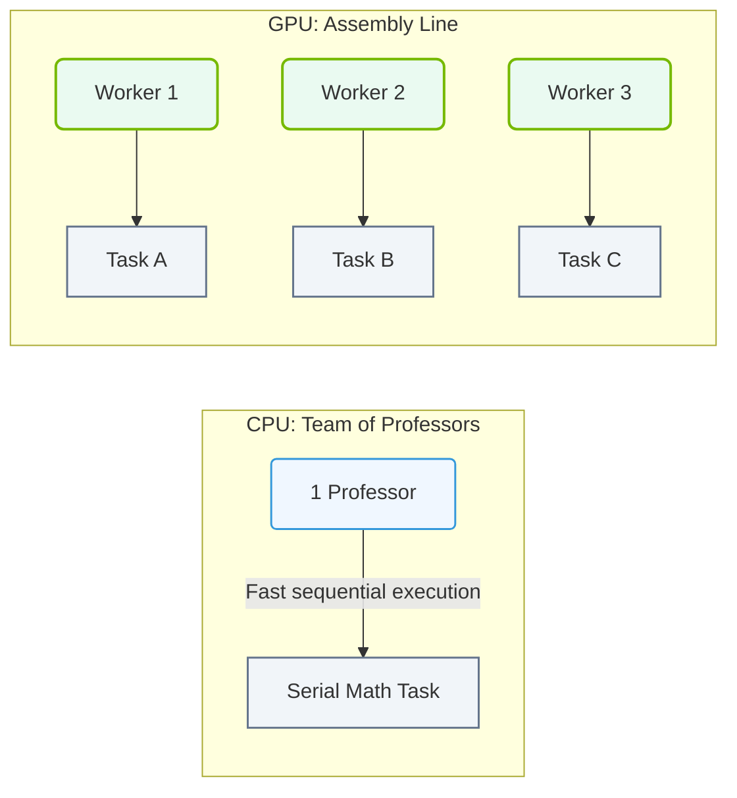

# 8.1c The 'smart professors vs. assembly line workers' analogy — and why AI needs the factory

#### 🏷️ The Mathematical Imperative — Why AI Demands Specialized Hardware > 8 The CPU-GPU Compute Divide — Why CPUs Cannot Scale for AI > 8.1 Serial vs. Parallel Processing — The Fundamental Design Philosophy Difference

---

## 🧠 Context Introduction

Imagine you have two very different types of workers in a large organization: a group of brilliant professors who can solve incredibly complex problems one at a time, and a team of assembly line workers who each perform a simple, repetitive task simultaneously. The professors are geniuses at deep, sequential thinking, but they can only handle one problem at a time. The assembly line workers, while individually less "smart," can process thousands of identical tasks in parallel, producing results at an astonishing speed.

This is the core difference between a **CPU (Central Processing Unit)** and a **GPU (Graphics Processing Unit)** — and it explains why modern AI needs a "factory" (the GPU) rather than just a "professor" (the CPU).

---

## ⚙️ The Analogy Explained

### 🎓 The Smart Professor (CPU)

- **Strengths:** Handles complex, varied tasks with high precision. Can switch between different problems quickly (e.g., running an operating system, browsing the web, editing a document).
- **Weaknesses:** Can only work on one or two tasks at a time. If you give it 10,000 simple math problems, it will solve them one by one — slowly.
- **Real-world role:** The CPU is the "manager" of the computer, making decisions and orchestrating workflows.

### 🏭 The Assembly Line Worker (GPU)

- **Strengths:** Performs thousands of simple, identical tasks simultaneously. Each "worker" (core) is less powerful than a professor, but there are thousands of them working in unison.
- **Weaknesses:** Not good at complex, varied tasks. If you ask it to write a novel or manage a database, it will struggle.
- **Real-world role:** The GPU is the "factory floor" — perfect for repetitive, parallel workloads like matrix multiplication, which is the foundation of AI.

---

## 📊 Comparison Table: Professor vs. Assembly Line Worker

| Feature | 🎓 Smart Professor (CPU) | 🏭 Assembly Line Worker (GPU) |
|---------|--------------------------|-------------------------------|
| **Number of workers** | 4–16 cores (a few experts) | 1,000–10,000+ cores (many simple workers) |
| **Task complexity** | Handles complex, varied tasks | Handles simple, repetitive tasks |
| **Speed per task** | Very fast for one task | Slower per individual task |
| **Parallel capability** | Poor (serial processor) | Excellent (massively parallel) |
| **Best for** | General computing, logic, decision-making | AI training, graphics rendering, scientific simulations |
| **Analogy** | A single genius solving a puzzle | A factory of workers assembling identical parts |

---

### 📊 Visual Representation: Professors (CPU) vs. Assembly Line (GPU) Analogy
This diagram visualizes the classic analogy: CPUs behave like a team of polymath professors solving complex serial logic, while GPUs function as a structured factory assembly line.

## 🛠️ Why AI Needs the Factory

AI, especially deep learning, relies on **matrix multiplications** — billions of simple math operations performed on large datasets. This is the "assembly line" work that GPUs excel at.

- **Training a neural network** involves multiplying huge matrices of numbers (weights and inputs) over and over again.
- A CPU (professor) would do this sequentially: *multiply cell 1, then cell 2, then cell 3...* — taking hours or days.
- A GPU (factory) does this in parallel: *all cells multiplied at once* — taking minutes or hours.

### 🔢 The Math Behind It

Consider a simple operation: multiplying two 1000x1000 matrices. This requires **1 billion individual multiplications**.

- **CPU (4 cores):** Processes about 4 multiplications at a time. Total time: **very long**.
- **GPU (4000 cores):** Processes about 4000 multiplications at a time. Total time: **250x faster**.

For reference, a typical AI training loop might perform this operation millions of times. The factory (GPU) is the only practical way to get results in a reasonable timeframe.

---

## 🕵️ Real-World Implications for Engineers

As an engineer entering the AI infrastructure field, understanding this analogy helps you make better decisions:

- **When to use CPUs:** For data preprocessing, orchestration, model serving with low latency, and general system management.
- **When to use GPUs:** For model training, large-scale inference, and any workload involving massive parallel computation.
- **Hybrid approach:** Modern AI systems use both — the CPU "professor" manages the workflow and feeds data to the GPU "factory" for heavy lifting.

### 🏗️ Key Takeaway

> AI doesn't just need smart thinkers — it needs a factory floor where thousands of simple workers can toil in parallel. The GPU is that factory, and understanding this distinction is the first step to designing efficient AI infrastructure.

---

## 📚 Summary

- **CPU = Smart Professor:** Excellent at sequential, complex tasks but slow for parallel work.
- **GPU = Assembly Line Worker:** Excellent at parallel, repetitive tasks but poor at complex logic.
- **AI needs the factory:** Because AI workloads (matrix multiplications) are inherently parallel and repetitive.
- **Engineers must choose wisely:** Use CPUs for control and GPUs for computation to build efficient AI systems.

---

*This analogy is a foundational concept for anyone working with AI infrastructure. It explains why modern AI data centers are filled with GPUs, not just CPUs — because training a neural network is less like solving a puzzle and more like running a massive, coordinated assembly line.*