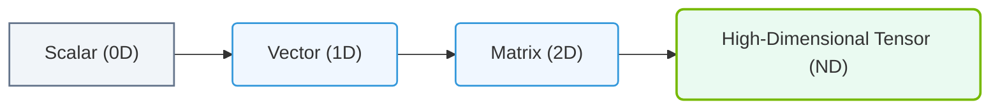

# 9.1d Tensors: N-dimensional arrays — a batch of images, sequences, or activations

#### 🏷️ The Mathematical Imperative — Why AI Demands Specialized Hardware > 9 The Mathematics of Deep Learning — Tensors, Operations & Numerical Precision > 9.1 Data Structures in Deep Learning

---

## 🧠 Context Introduction

When you start working with AI infrastructure, you'll quickly encounter the term **tensor**. Think of a tensor as a container for numbers — like a spreadsheet, but with extra dimensions. In deep learning, nearly everything is represented as a tensor: images, audio clips, text sequences, and even the internal "activations" that flow through a neural network.

For new engineers, understanding tensors is essential because they are the fundamental data structure that flows through GPUs, memory buses, and storage systems. When you monitor GPU utilization, memory bandwidth, or data pipeline throughput, you are ultimately tracking how tensors are moved, transformed, and processed.

---

## 📦 What Is a Tensor?

A tensor is simply an **N-dimensional array** of numbers. The "N" tells you how many dimensions (or axes) the tensor has.

| Number of Dimensions | Common Name | Example Use Case |
|----------------------|-------------|------------------|
| 0 | Scalar | A single number (e.g., loss value) |
| 1 | Vector | A list of features (e.g., pixel values in grayscale) |
| 2 | Matrix | A grayscale image (height × width) |
| 3 | 3D Tensor | A color image (height × width × RGB channels) |
| 4 | 4D Tensor | A batch of color images (batch × height × width × channels) |
| 5+ | N-D Tensor | Video clips, 3D medical scans, or complex sequences |

---

## 🖼️ A Batch of Images as a 4D Tensor

Imagine you have **32 color images**, each **256 pixels tall** and **256 pixels wide**, with **3 color channels** (Red, Green, Blue). This entire batch is stored as a single 4D tensor with shape:

**32 × 256 × 256 × 3**

- **Dimension 0 (Batch):** 32 — the number of images in the batch
- **Dimension 1 (Height):** 256 — pixel rows
- **Dimension 2 (Width):** 256 — pixel columns
- **Dimension 3 (Channels):** 3 — RGB color values

Each individual pixel value is a number (e.g., 0–255 for 8-bit images, or a floating-point number after normalization). When you run inference or training, the GPU processes this entire 4D tensor in parallel.

---

## 🧵 Sequences as 2D or 3D Tensors

Text, audio, or time-series data are often represented as **sequences**. For example:

- A **sentence** of 50 words, each represented by a 300-dimensional vector, becomes a 2D tensor: **50 × 300**
- A **batch of 16 sentences**, each 50 words long with 300-dimensional vectors, becomes a 3D tensor: **16 × 50 × 300**

Here:
- **Dimension 0 (Batch):** 16 sentences
- **Dimension 1 (Sequence length):** 50 words per sentence
- **Dimension 2 (Feature dimension):** 300 numbers per word

---

### 📊 Visual Representation: Multi-Dimensional Tensor Generalization
This flowchart demonstrates the structural progression of numeric tensors from 0D scalars up to multi-dimensional data blocks.

## ⚡ Activations as Tensors

Inside a neural network, every layer produces **activations** — the output values that flow to the next layer. These activations are always tensors.

For example, after a convolutional layer in an image model, you might get a 4D activation tensor:

**32 × 64 × 64 × 128**

- **32:** batch size
- **64 × 64:** spatial dimensions (height and width)
- **128:** number of feature maps (channels)

These activation tensors are what consume GPU memory during training. Engineers monitor memory usage by tracking the size of these tensors.

---

## 🛠️ Why Tensors Matter for Infrastructure and Operations

As an engineer working with AI infrastructure, you will encounter tensors in several practical ways:

- **Memory planning:** A single 4D tensor of shape **32 × 256 × 256 × 3** with 32-bit floats uses **32 × 256 × 256 × 3 × 4 bytes = 24 MB**. Multiply this by dozens of layers, and you quickly understand GPU memory constraints.

- **Data pipeline design:** When loading data, you must ensure tensors are shaped correctly before feeding them into the model. Mismatched dimensions cause runtime errors.

- **Performance tuning:** Larger tensors (bigger batches, higher resolution) increase throughput but also increase memory pressure. Engineers balance batch size against available GPU memory.

- **Mixed precision:** Using 16-bit (half-precision) tensors instead of 32-bit can halve memory usage and speed up computation, but requires careful handling to avoid numerical instability.

---

## 📊 Comparison: Common Tensor Shapes in Practice

| Data Type | Typical Shape | Memory (32-bit float) | Notes |
|-----------|---------------|-----------------------|-------|
| Single grayscale image | 1 × 224 × 224 × 1 | ~200 KB | Small, often processed in batches |
| Batch of color images | 32 × 224 × 224 × 3 | ~19 MB | Common for training |
| Batch of high-res images | 16 × 1024 × 1024 × 3 | ~192 MB | High memory demand |
| Text sequence (batch) | 32 × 128 × 768 | ~12 MB | Typical for BERT-like models |
| Activation tensor (large layer) | 32 × 56 × 56 × 256 | ~51 MB | Mid-layer in ResNet |

---

## 🕵️ Key Takeaways for New Engineers

- **Tensors are just multi-dimensional arrays** — they are the universal data structure in deep learning.
- **Shape matters** — always check the shape of your tensors (batch, height, width, channels, or sequence length, features).
- **Memory scales with tensor size** — doubling any dimension roughly doubles memory usage.
- **Batches combine multiple samples** — the first dimension is almost always the batch size.
- **Activations are tensors too** — every layer's output is a tensor that must fit in GPU memory.

When you see GPU memory errors or data pipeline bottlenecks, start by examining the shapes and sizes of your tensors. This simple habit will help you debug and optimize AI workloads effectively.

