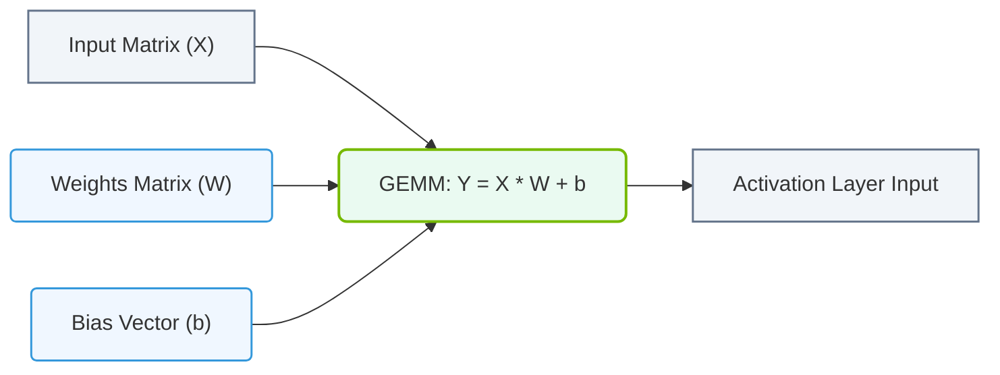

# 9.2a Why General Matrix Multiply (GEMM) accounts for 90%+ of DNN compute

#### 🏷️ The Mathematical Imperative — Why AI Demands Specialized Hardware > 9 The Mathematics of Deep Learning — Tensors, Operations & Numerical Precision > 9.2 Matrix Multiplication — The Core Operation of Every Neural Network

## 📖 Context Introduction

Deep Neural Networks (DNNs) are the engines behind modern AI — from image recognition to natural language processing. At their core, these networks perform an enormous number of mathematical operations. The most dominant of these operations is **General Matrix Multiply (GEMM)** . Understanding why GEMM accounts for over 90% of all compute in a DNN is essential for any engineer working with AI infrastructure and operations. This topic explains the "why" in simple, practical terms.

---

## ⚙️ What is GEMM?

GEMM is the mathematical operation of multiplying two matrices together. In a neural network, this operation is used to transform input data as it passes through layers.

- **Matrix A** typically represents the input data (e.g., a batch of images or text tokens).
- **Matrix B** represents the learned weights of the network.
- **Matrix C** is the output, which becomes the input for the next layer.

The formula is: **C = A × B**

---

## 🧠 Why Does GEMM Dominate DNN Compute?

The reason GEMM accounts for such a large percentage of compute is due to the fundamental structure of neural networks. Here are the key factors:

### 🔹 Fully Connected Layers (Dense Layers)
- Every neuron in one layer is connected to every neuron in the next layer.
- This is a direct matrix multiplication: **output = input × weights**.
- In large models (e.g., GPT-3, BERT), these layers can have millions or billions of parameters.

### 🔹 Convolutional Layers (Image Processing)
- Convolutions are often implemented as matrix multiplications using a technique called **im2col** (image to column).
- This converts the convolution operation into a large GEMM, making it efficient on GPUs.

### 🔹 Attention Mechanisms (Transformers)
- The "attention" operation in transformers (used in LLMs) relies heavily on matrix multiplications.
- Queries, keys, and values are all matrices that are multiplied together.

### 🔹 Batch Processing
- To maximize throughput, inputs are processed in batches.
- A batch of inputs is a matrix, and the weights are another matrix — again, a GEMM.

---

## 📊 Breakdown of Compute in a Typical DNN

| Operation | Percentage of Total Compute | Why It's a GEMM |
| :--- | :--- | :--- |
| **Forward Pass (Inference)** | ~50% | Input × Weights for each layer |
| **Backward Pass (Training)** | ~40% | Gradients × Weights (transposed) |
| **Weight Updates** | ~5% | Learning rate × Gradients |
| **Other (Activations, Normalization)** | ~5% | Element-wise operations, not GEMM |

> **Key Insight:** The forward and backward passes together account for ~90% of compute, and both are dominated by GEMM operations.

---

### 📊 Visual Representation: General Matrix Multiply (GEMM) in Deep Learning
This diagram shows how standard linear neural network layers are computed as dense GEMM operations on modern processor cores.

## 🛠️ Why Engineers Should Care About GEMM

Understanding GEMM is critical for optimizing AI infrastructure. Here’s why:

- **Hardware Utilization:** GPUs and specialized AI accelerators (like NVIDIA Tensor Cores) are designed to perform GEMM extremely fast. If your workload is not GEMM-heavy, you may not be using the hardware efficiently.
- **Memory Bandwidth:** GEMM operations are compute-bound, meaning the speed is limited by how fast the hardware can multiply, not by how fast it can read memory. This is why GPUs have thousands of cores.
- **Quantization & Precision:** Lower precision (e.g., FP16, INT8) allows for faster GEMM operations because the hardware can pack more operations per cycle. This is a key optimization for inference.
- **Model Architecture:** Engineers designing or selecting models should know that models with fewer GEMM-heavy layers (e.g., sparse models) may be slower on standard hardware.

---

## 🕵️ A Simple Analogy

Think of a neural network as a massive factory assembly line.

- **GEMM** is the conveyor belt that moves every single product through every single station.
- **Other operations** (like activation functions) are the quality checks at each station — important, but they happen much less frequently.
- If the conveyor belt (GEMM) slows down, the entire factory slows down.

---

## 💡 Key Takeaway for New Engineers

When you are working with AI infrastructure:

1. **Profile your workload** — If you see high GPU utilization but low throughput, you are likely GEMM-bound.
2. **Optimize for GEMM** — Use mixed precision (FP16/INT8) and batch sizes that align with your hardware's matrix unit size (e.g., multiples of 16 or 32 for Tensor Cores).
3. **Monitor memory** — GEMM operations need fast memory access. Ensure your data is in the right memory tier (HBM vs. GDDR vs. system RAM).

---

## 📝 Summary

- **GEMM** is the core operation of every neural network layer.
- It accounts for **90%+ of compute** because forward and backward passes are dominated by matrix multiplications.
- **Hardware specialization** (GPUs, Tensor Cores) is driven by the need to accelerate GEMM.
- As an engineer, understanding GEMM helps you choose the right hardware, optimize model performance, and debug bottlenecks.

---

*Next topic: 9.2b — How Tensor Cores accelerate GEMM operations*