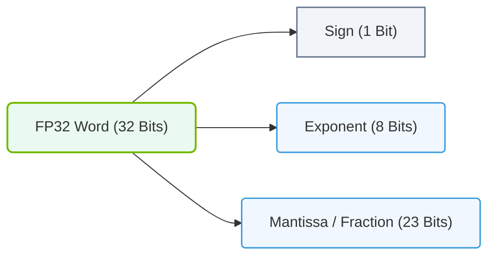

# 9.3b FP32 (single precision): 32-bit — the historical default for deep learning

#### 🏷️ The Mathematical Imperative — Why AI Demands Specialized Hardware > 9 The Mathematics of Deep Learning — Tensors, Operations & Numerical Precision > 9.3 Numerical Precision and Data Types — The Speed-Accuracy Tradeoff

## 📖 Context Introduction

Before diving into modern mixed-precision training, it's essential to understand **FP32 (single precision)** — the original workhorse of deep learning. For nearly a decade, FP32 was the default numerical format used to train neural networks. While newer formats like FP16 and BF16 offer speed advantages, FP32 remains the gold standard for accuracy and stability. This guide explains what FP32 is, why it became the historical default, and where it still matters today.

---

## ⚙️ What is FP32?

FP32 stands for **Floating Point 32-bit**, also known as **single precision** in the IEEE 754 standard. It uses 32 bits of memory to represent a single number.

**Bit breakdown of FP32:**
- **1 bit** — Sign (positive or negative)
- **8 bits** — Exponent (determines the range)
- **23 bits** — Mantissa (determines the precision)

**Key characteristics:**
- **Range:** Approximately ±1.18 × 10⁻³⁸ to ±3.4 × 10³⁸
- **Precision:** About 7 decimal digits of accuracy
- **Memory usage:** 4 bytes per number

---

## 🧠 Why FP32 Became the Historical Default for Deep Learning

FP32 was the natural starting point for deep learning for several practical reasons:

- **Hardware availability:** Early GPUs (like NVIDIA Kepler and Maxwell architectures) were optimized for FP32 operations.
- **Numerical stability:** The 8-bit exponent provides enough range to avoid overflow/underflow during training.
- **Framework defaults:** TensorFlow, PyTorch, and Caffe all defaulted to FP32 tensors.
- **Simplicity:** Engineers didn't need to worry about precision loss — FP32 "just worked" for most models.
- **Backward compatibility:** Pre-trained models and research papers were all published using FP32 weights.

---

## 📊 FP32 vs. Other Common Precision Formats

| Feature | **FP32** (Single Precision) | **FP16** (Half Precision) | **BF16** (Brain Float) |
|---------|-----------------------------|---------------------------|------------------------|
| Total bits | 32 | 16 | 16 |
| Exponent bits | 8 | 5 | 8 |
| Mantissa bits | 23 | 10 | 7 |
| Dynamic range | Very wide | Narrow | Wide (same as FP32) |
| Precision | High (7 decimal digits) | Moderate (3 decimal digits) | Low (2 decimal digits) |
| Memory usage | 4 bytes | 2 bytes | 2 bytes |
| Training speed | Baseline | ~2x faster | ~2x faster |
| Numerical stability | Excellent | Requires care | Good |

---

### 📊 Visual Representation: Single Precision (FP32) Bit Breakdown
This diagram details the bit allocations (1 sign bit, 8 exponent bits, 23 mantissa bits) of standard IEEE 754 Single Precision float formats.

## 🛠️ When to Use FP32 in Modern AI Infrastructure

Even with faster alternatives, FP32 remains relevant in specific scenarios:

- **Training very deep networks** (e.g., 100+ layers) where gradient accumulation requires high precision
- **Fine-tuning pre-trained models** where weight updates are tiny and need full precision
- **Inference on older hardware** that lacks native FP16/BF16 support
- **Debugging and validation** — when a model fails with lower precision, FP32 is the "safety net"
- **Scientific computing** workloads that require maximum numerical accuracy

---

## 🕵️ Practical Considerations for Engineers

**Memory footprint example:**
A model with 100 million parameters:
- **FP32:** 100M × 4 bytes = **400 MB**
- **FP16:** 100M × 2 bytes = **200 MB**

**Training speed impact:**
- FP32 operations are typically **1x baseline**
- FP16/BF16 can achieve **1.5x to 3x speedup** on modern GPUs with Tensor Cores

**When FP32 is still the safer choice:**
- Your model uses **LayerNorm** or **BatchNorm** with very small epsilon values
- You observe **NaN losses** when switching to lower precision
- You are working with **recurrent neural networks (RNNs)** or **LSTMs** which are sensitive to precision

---

## 🔧 How to Check and Set FP32 in Practice

**In PyTorch (default behavior):**
- All tensors are FP32 by default
- To explicitly set: `model = model.float()`
- To verify: `print(model.dtype)` — outputs `torch.float32`

**In TensorFlow (default behavior):**
- Default dtype is `float32`
- To verify: `print(model.dtype)` — outputs `float32`

**In NVIDIA CUDA:**
- Default kernel launches use FP32
- To check GPU FP32 performance: use `nvidia-smi` and look for "FP32" in compute capabilities

---

## ✅ Summary — Key Takeaways for New Engineers

- **FP32 is the historical default** for deep learning — it's reliable, well-supported, and numerically stable.
- **It uses 32 bits (4 bytes)** per number, providing ~7 decimal digits of precision.
- **Modern training often uses mixed precision** (FP16/BF16) for speed, but FP32 remains the fallback.
- **Always validate your model in FP32 first** before attempting lower-precision optimization.
- **Memory and speed tradeoffs** are critical: FP32 uses more memory but offers higher accuracy.

> **Rule of thumb:** Start with FP32 for prototyping and debugging. Move to lower precision only after confirming model stability.