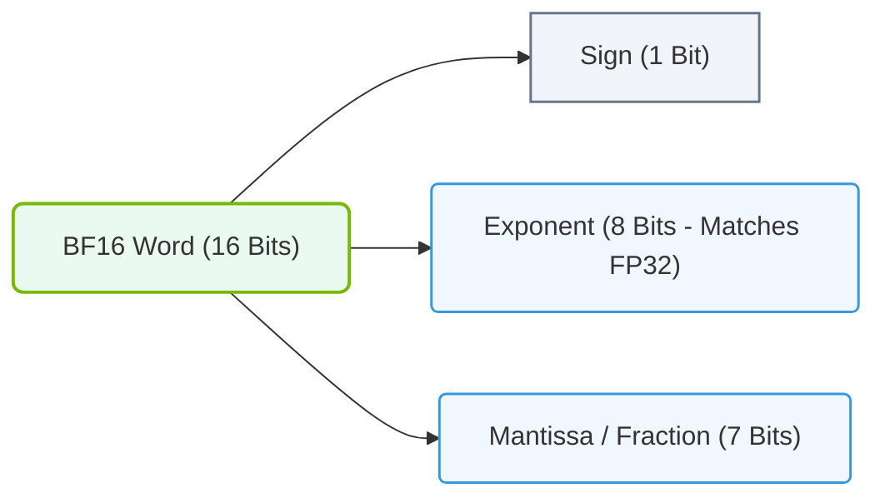

# 9.3d BF16 (Brain Float 16): Google's format with FP32 exponent range — preferred for training

#### 🏷️ The Mathematical Imperative — Why AI Demands Specialized Hardware > 9 The Mathematics of Deep Learning — Tensors, Operations & Numerical Precision > 9.3 Numerical Precision and Data Types — The Speed-Accuracy Tradeoff

## 🧠 Context Introduction

When training large neural networks, engineers face a constant tug-of-war between **speed** and **accuracy**. Traditional 32-bit floating point (FP32) is precise but slow and memory-hungry. 16-bit floating point (FP16) is faster and uses less memory, but its limited range can cause numerical instability during training. Enter **BF16 (Brain Float 16)** — a format developed by Google that combines the best of both worlds: the wide exponent range of FP32 with the memory efficiency of 16-bit storage. This makes BF16 the go-to choice for training modern deep learning models.

---

## ⚙️ What is BF16?

BF16 is a 16-bit floating-point data type that uses:
- **1 sign bit**
- **8 exponent bits** (same as FP32)
- **7 mantissa (fraction) bits** (fewer than FP32's 23 bits)

This design preserves the **dynamic range** of FP32 (allowing very large and very small numbers) while only storing 16 bits per value. The trade-off is reduced precision (fewer decimal places), but for most deep learning training, this is acceptable.

---

## 📊 Comparison: FP32 vs FP16 vs BF16

| Feature | FP32 (Single Precision) | FP16 (Half Precision) | BF16 (Brain Float 16) |
|---------|------------------------|-----------------------|------------------------|
| **Total bits** | 32 | 16 | 16 |
| **Exponent bits** | 8 | 5 | 8 |
| **Mantissa bits** | 23 | 10 | 7 |
| **Dynamic range** | ~3.4×10³⁸ | ~6.5×10⁴ | ~3.4×10³⁸ |
| **Memory usage** | 4 bytes | 2 bytes | 2 bytes |
| **Training stability** | Very high | Low (prone to overflow/underflow) | High (same range as FP32) |
| **Hardware support** | Universal | Widely supported | NVIDIA A100+, Ampere+ GPUs |

---

## 🛠️ Why BF16 is Preferred for Training

- **Wider exponent range prevents gradient underflow** — During backpropagation, gradients can become very small. FP16's limited range (5 exponent bits) often causes these tiny values to underflow to zero, killing training. BF16's 8 exponent bits match FP32, so gradients survive.
- **Reduced memory footprint** — Using BF16 halves the memory required for model weights, activations, and gradients compared to FP32. This allows engineers to train larger models or use larger batch sizes on the same hardware.
- **Faster computation** — BF16 operations are typically 2–4x faster than FP32 on modern GPUs (e.g., NVIDIA A100, H100) because the hardware can process more 16-bit operations per cycle.
- **No need for loss scaling** — With FP16, engineers often must apply "loss scaling" (multiplying the loss by a constant) to prevent underflow. BF16 eliminates this extra step, simplifying the training pipeline.

---

### 📊 Visual Representation: Brain Floating Point (BF16) Bit Breakdown
This diagram displays the bit allocations (1 sign bit, 8 exponent bits, 7 mantissa bits) of the BF16 format, which matches FP32 dynamic range but with lower precision.

## 🕵️ Real-World Example: BF16 in Action

Consider training a large language model with 1 billion parameters:
- **With FP32**: Each parameter uses 4 bytes → 4 GB for weights alone. Gradients and optimizer states triple the memory to ~12 GB.
- **With BF16**: Each parameter uses 2 bytes → 2 GB for weights. Total memory drops to ~6 GB.

This memory savings means you can either:
- Train a larger model on the same GPU
- Increase batch size for better convergence
- Reduce the number of GPUs needed, lowering cost

---

## 🧪 When to Use BF16 vs Other Formats

| Scenario | Recommended Format | Reason |
|----------|-------------------|--------|
| Training large models (LLMs, ViTs) | **BF16** | Wide range prevents gradient issues; memory efficient |
| Inference (deployment) | FP16 or INT8 | Speed and memory are critical; accuracy loss is acceptable |
| Mixed precision training | BF16 + FP32 master weights | Best of both worlds: fast forward/backward, precise weight updates |
| Scientific computing | FP32 or FP64 | High precision required for non-ML workloads |

---

## 🔧 How to Enable BF16 in Practice

Most deep learning frameworks support BF16 with a simple flag or context manager:

**For PyTorch:**
- Use `torch.bfloat16` dtype when creating tensors
- Wrap training loop with `with torch.autocast(device_type='cuda', dtype=torch.bfloat16):`

**For TensorFlow:**
- Set `tf.keras.mixed_precision.set_global_policy('bfloat16')`
- Or use `tf.cast(tensor, tf.bfloat16)`

**For NVIDIA GPUs:**
- BF16 requires compute capability 8.0+ (A100, H100, RTX 3090, etc.)
- Check with: `nvidia-smi --query-gpu=name --format=csv,noheader`

---

## ✅ Key Takeaways for New Engineers

- **BF16 is not just "FP16 with a different name"** — its 8-bit exponent is the critical difference that makes it suitable for training.
- **Memory is often the bottleneck** — BF16 cuts memory usage in half versus FP32, enabling larger models.
- **Hardware matters** — BF16 is only supported on NVIDIA Ampere (A100) and newer architectures. Always verify your GPU's capabilities.
- **Start with BF16 by default** — For most modern deep learning training, BF16 offers the best balance of speed, memory, and numerical stability. Only fall back to FP32 if you encounter accuracy issues.

---

## 📚 Further Reading

- Google Brain Team: "Mixed Precision Training" (ICLR 2018)
- NVIDIA Developer Blog: "Training with Mixed Precision"
- IEEE 754 standard for floating-point arithmetic (BF16 is not IEEE standard, but follows similar principles)