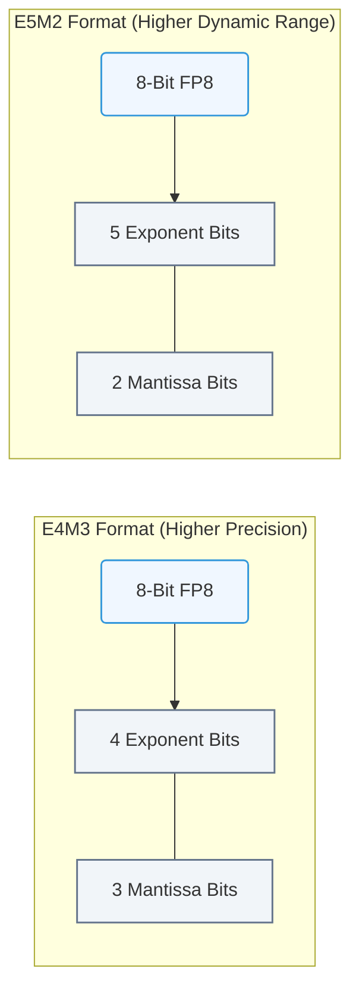

# 9.3f FP8 (E4M3/E5M2): NVIDIA Hopper's new training format

#### 🏷️ The Mathematical Imperative — Why AI Demands Specialized Hardware > 9 The Mathematics of Deep Learning — Tensors, Operations & Numerical Precision > 9.3 Numerical Precision and Data Types — The Speed-Accuracy Tradeoff

---

## 🔍 Context Introduction

Deep learning models are growing larger every year, demanding more memory and compute power. Engineers have traditionally used **FP32** (32-bit floating point) for training and **FP16** (16-bit) for faster inference. But NVIDIA's Hopper architecture introduced a breakthrough: **FP8** — an 8-bit floating point format that cuts memory usage in half compared to FP16 while maintaining training accuracy. This topic explains the two FP8 variants — **E4M3** and **E5M2** — and how they enable faster, more efficient AI training.

---

## ⚙️ What is FP8?

FP8 is an 8-bit floating-point data type that uses fewer bits than FP16 (16 bits) or FP32 (32 bits). It comes in two flavors, defined by how many bits are allocated to the **exponent** (E) and **mantissa** (M):

- **E4M3**: 4 exponent bits + 3 mantissa bits
- **E5M2**: 5 exponent bits + 2 mantissa bits

The tradeoff is simple:
- More exponent bits = wider dynamic range (can represent very large or very small numbers)
- More mantissa bits = higher precision (more accurate decimal representation)

---

## 📊 E4M3 vs E5M2 — Key Differences

| Feature | E4M3 | E5M2 |
|---------|------|------|
| **Exponent bits** | 4 | 5 |
| **Mantissa bits** | 3 | 2 |
| **Dynamic range** | Smaller (~±448) | Larger (~±57,344) |
| **Precision** | Higher (more decimal accuracy) | Lower (less decimal accuracy) |
| **Best use case** | Forward pass (activations, weights) | Backward pass (gradients) |
| **Example value** | Can represent 1.5 with good accuracy | Can represent 1.5 but with less precision |

---

## 🛠️ How Hopper Uses FP8 in Training

NVIDIA Hopper GPUs (H100, H200) use **mixed-precision training** with FP8. The process works like this:

- **Forward pass** (calculating predictions): Uses **E4M3** for weights and activations — high precision helps maintain accuracy
- **Backward pass** (calculating gradients): Uses **E5M2** for gradients — wider range prevents underflow/overflow
- **Master weights** (the "source of truth"): Still stored in **FP32** to preserve full precision

This hybrid approach allows:
- **2x memory savings** compared to FP16 training
- **Up to 2x faster training** on compatible hardware
- **No significant accuracy loss** for most models

---

### 📊 Visual Representation: FP8 Formats: E4M3 vs. E5M2
This diagram contrasts the two standard 8-bit float structures: E4M3 (best for weights/activations) and E5M2 (best for gradients).



## 🕵️ Why Two Formats? The Precision vs Range Tradeoff

Think of it like a camera lens:
- **E4M3** is like a high-resolution lens with a narrow zoom range — great for close-up details
- **E5M2** is like a wide-angle lens with lower resolution — captures a broader scene

During training:
- **Forward pass** needs precise calculations (like reading fine print) → use E4M3
- **Backward pass** needs to handle very small or very large gradient values (like capturing both a bright sky and dark shadows) → use E5M2

---

## 📈 Practical Benefits for Engineers

- **Reduced memory footprint**: Train larger models on the same GPU
- **Faster training loops**: FP8 operations are 2x faster than FP16 on Hopper
- **Lower power consumption**: Fewer bits means less energy per operation
- **Compatibility**: Works with existing frameworks like PyTorch and TensorFlow via NVIDIA's Transformer Engine

---

## 🧪 Example: FP8 in Action

For reference, here's how you might enable FP8 training in PyTorch using NVIDIA's Transformer Engine:

```
import transformer_engine.pytorch as te
from transformer_engine.common.recipe import Format, DelayedScaling

# Enable FP8 with automatic format selection
fp8_recipe = DelayedScaling(
    fp8_format=Format.HYBRID,  # Uses E4M3 for forward, E5M2 for backward
    amax_history_len=16,
    amax_compute_algo="max"
)

# Wrap your model with FP8 support
model = te.Linear(in_features=512, out_features=256)
```

**📤 Output:** The model now uses FP8 automatically during training, with no manual format switching required.

---

## 🎯 Key Takeaways for New Engineers

- **FP8 is not one format, but two**: E4M3 (precision-focused) and E5M2 (range-focused)
- **Hopper GPUs automatically switch** between these formats during training
- **Memory and speed benefits** are substantial — up to 2x improvement over FP16
- **Accuracy is preserved** through careful mixed-precision design
- **No manual tuning needed** — frameworks handle the complexity

---

## 📚 Further Learning

- NVIDIA's **Transformer Engine** documentation for framework integration
- **Mixed-precision training** guides (FP16, BF16, FP8)
- **Hopper architecture whitepapers** for hardware-level details
- **Benchmarking tools** to measure FP8 speedup on your workloads

---

*FP8 is a game-changer for AI infrastructure — it allows engineers to train larger models faster without sacrificing accuracy. Understanding E4M3 and E5M2 is your first step toward mastering modern GPU-accelerated training.*

