# 9.3h Loss scaling: preventing underflow in half-precision gradients

#### 🏷️ The Mathematical Imperative — Why AI Demands Specialized Hardware > 9 The Mathematics of Deep Learning — Tensors, Operations & Numerical Precision > 9.3 Numerical Precision and Data Types — The Speed-Accuracy Tradeoff

## 📘 Context Introduction

When training deep learning models, you often use **half-precision** (FP16) to speed up training and reduce memory usage. However, FP16 has a much smaller range of representable numbers compared to full-precision (FP32). During backpropagation, gradients can become very small — so small that they "underflow" to zero in FP16. This kills learning because the model stops updating its weights. **Loss scaling** is a technique that multiplies the loss value by a large factor before backpropagation, preventing these tiny gradients from vanishing.

---

## ⚙️ The Problem: Underflow in Half-Precision Gradients

- **FP16 range**: Approximately 6.0 × 10⁻⁸ to 65,504. Any value smaller than ~6.0 × 10⁻⁸ becomes zero.
- **Gradient behavior**: Many gradients in deep networks, especially in early layers, are extremely small (e.g., 1.0 × 10⁻¹⁰).
- **Consequence**: These small gradients underflow to zero in FP16, stopping weight updates for those layers.
- **Result**: The model fails to converge or trains very slowly.

---

## 🛠️ How Loss Scaling Works

Loss scaling solves underflow by:

1. **Multiplying the loss** by a scaling factor (e.g., 2⁸ = 256) before backpropagation.
2. **Computing gradients** in FP16 using this scaled loss — gradients are now larger and within FP16 range.
3. **Dividing the gradients** by the same scaling factor after backpropagation, restoring their true magnitude.
4. **Updating weights** with the correctly scaled gradients.

**Visual flow:**

Loss (FP32) → Multiply by scale factor → Backprop in FP16 → Divide gradients by scale factor → Update weights

---

## 📊 Comparison: Without vs. With Loss Scaling

| Aspect | Without Loss Scaling | With Loss Scaling |
|--------|---------------------|-------------------|
| Gradient precision | Many gradients underflow to zero | Gradients remain representable in FP16 |
| Training stability | Poor — early layers stop learning | Stable — all layers update properly |
| Memory usage | Low (FP16 only) | Low (FP16 + one scale factor) |
| Speed | Fast but inaccurate | Fast and accurate |
| Implementation complexity | Simple | Requires scale factor management |

---

### 📊 Visual Representation: Loss Scaling Gradient Protection
This diagram displays how loss scaling multiplies training loss to shift gradient distributions out of the FP16 underflow range.

```mermaid
flowchart LR
    Loss["Calculate Loss"] -->|Multiply by Scale Factor| ScaledLoss["Scaled Loss"]
    ScaledLoss --> Backprop["Backward Pass (Gradients Scaled Up)"]
    Backprop --> Unscale["Unscale Gradients (Divide by Scale Factor)"]
    Unscale --> Update["Weight Update (Safe from Underflow)"]

    classDef cpu fill:#eafaf1,stroke:#76b900,stroke-width:2px,rx:6px,ry:6px;
    classDef memory fill:#f0f7ff,stroke:#3498db,stroke-width:1.5px,rx:4px,ry:4px;
    classDef system fill:#f1f5f9,stroke:#64748b,stroke-width:1.5px;

    class Backprop cpu;
    class Loss,ScaledLoss memory;
    class Unscale,Update system;
```



## 🕵️ Common Scaling Strategies

- **Static loss scaling**: Use a fixed scale factor (e.g., 2⁸ or 2¹⁶). Simple but may need manual tuning.
- **Dynamic loss scaling**: Adjust the scale factor during training based on gradient behavior:
  - If no overflow occurs for N steps → increase scale factor (e.g., multiply by 2).
  - If overflow occurs → decrease scale factor (e.g., divide by 2) and skip the batch.
- **Automatic mixed precision (AMP)**: Modern frameworks handle loss scaling automatically. Engineers only enable it.

---

## 🧪 Practical Example (Conceptual)

**For reference:**
```
# Conceptual steps in training loop
loss = model(inputs, targets)

# Step 1: Scale the loss
scaled_loss = loss * scale_factor

# Step 2: Backpropagate with scaled loss
scaled_loss.backward()

# Step 3: Unscale gradients before optimizer step
for param in model.parameters():
    param.grad = param.grad / scale_factor

# Step 4: Update weights
optimizer.step()
```

📤 **Output:** Gradients that would have been zero in FP16 now have values like **0.0001** instead of **0.0**.

---

## ✅ Key Takeaways for New Engineers

- **Loss scaling is essential** when using FP16 training — without it, many gradients vanish.
- **Dynamic scaling** is preferred because it adapts to your model's behavior automatically.
- **Modern frameworks** (PyTorch, TensorFlow) include built-in AMP with automatic loss scaling — you just enable it.
- **Monitor for overflow**: If you see NaN losses or gradients, your scale factor may be too high.
- **No performance penalty**: The scaling operation is a simple multiplication/division and adds negligible overhead.

---

## 📚 Summary

Loss scaling is a simple but critical technique that makes half-precision training practical. By preventing gradient underflow, it allows engineers to enjoy the speed and memory benefits of FP16 without sacrificing model accuracy. Always use loss scaling (preferably dynamic) when training with mixed precision.